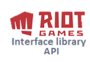

<p align="center">
  
</p>

<p align="center">Interface library for the Riot Games Rest API</p>

##
[](https://github.com/GoldenGuillaume/RiotGames)
[](https://docs.microsoft.com/fr-fr/dotnet/standard/net-standard)
[](https://github.com/GoldenGuillaume/RiotGames)
[](https://github.com/GoldenGuillaume/RiotGames)


## Install

Currently not on Nuget, clone the repository and add reference. To make it work you need to set a new environment variable called `ASPNETCORE_API_TOKEN` with your API key to be able to launch Http requests.

## Compatibility

The project is built with .NET Standard version 2.0.3, it support compatibility with .NET Framework, .Net Core, Mono and Xamarin refer to [this link](https://docs.microsoft.com/fr-fr/dotnet/standard/net-standard)
to get version compatibilities.

## Usage


###### 1. Standard usage:

```CSharp
IRiotGamesApiService service = new LeagueService(LocationEnum.EUW1);
service.GetChallengerLeagueByQueue(QueueEnum.RANKED_SOLO_5X5);
```

###### 2. Dependency injection inside an ASP .Net Core project:

```CSharp
public void ConfigureServices(IServiceCollection services)
{
    /* Add Api implementation services */
    services.AddHttpClient<SummonerService>();
    services.AddHttpClient<LeagueService>();
    services.AddHttpClient<MatchService>();
}
```

## License

For the moment, not under any licence.
